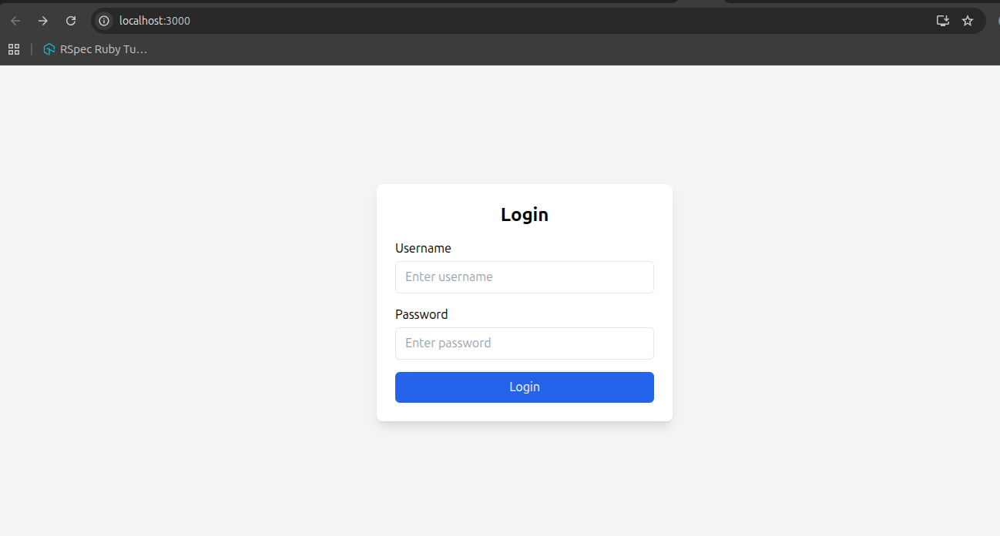
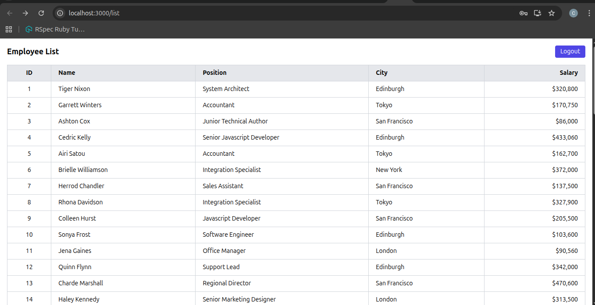
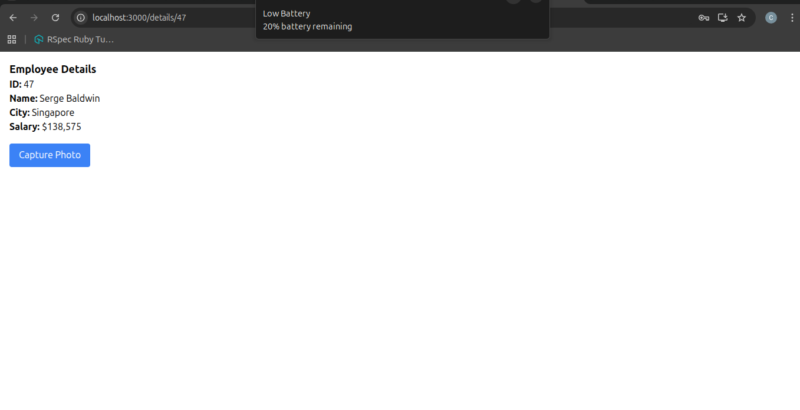
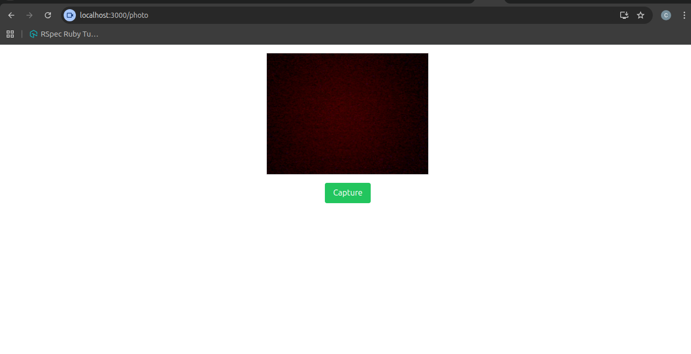
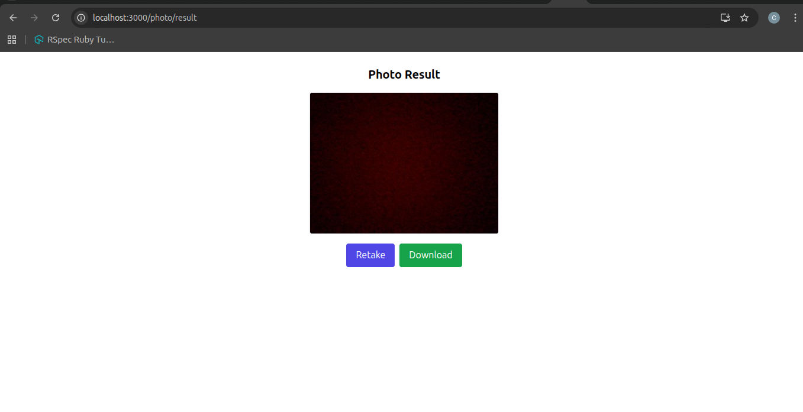
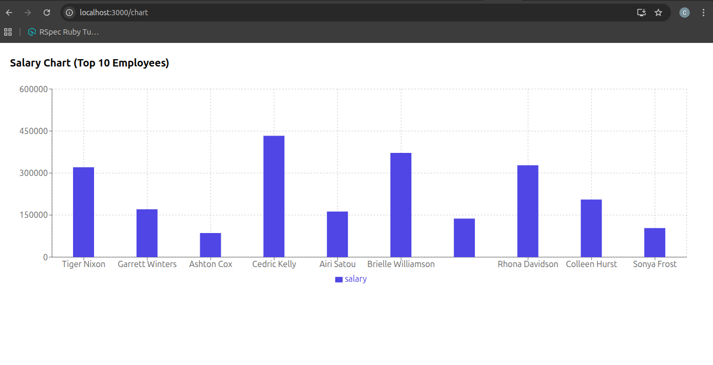
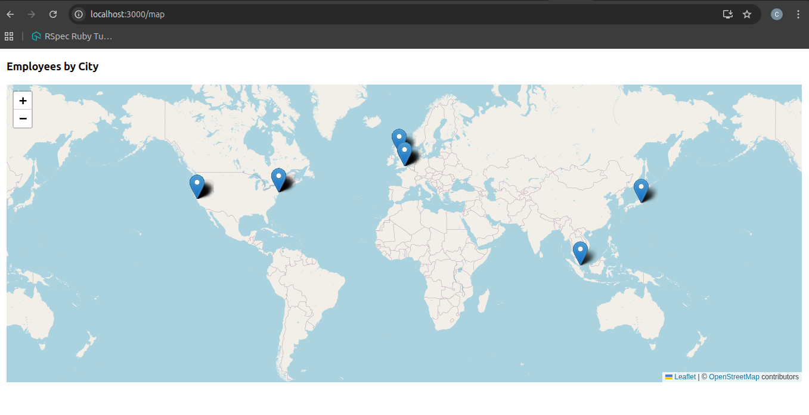

# Employee Portal (React)

A simple employee portal built with React. It includes login, a table of employees fetched from a proxied API, employee details and photo capture, a salary chart, and a city map view. Routes are protected with a basic client-side auth guard.

## Features

- Login page with demo credentials and persisted session
- Employee list fetched from backend via proxy
- Details page with navigation from list
- Photo capture using `react-webcam`
- Salary chart using `recharts`
- City map using `react-leaflet`
- Protected routes and logout

## Quick Start

- Install dependencies: `npm install`
- Start dev server: `npm start`
- Open: `http://localhost:3000`

Demo login (for development/testing):
- Username: `testuser`
- Password: `Test123`

## Scripts

- `npm start` — run development server
- `npm test` — run tests (watch mode)
- `npm run build` — production build
- `npm run eject` — eject CRA (irreversible)

## Routes

- `/` — Login
- `/list` — Employee list (protected)
- `/details/:id` — Details (protected; expects navigation state)
- `/photo` — Capture photo (protected)
- `/chart` — Salary chart (protected; expects navigation state)
- `/map` — City map (protected; expects navigation state)
- `*` — 404 Not Found

If you load a protected page directly without prior navigation, the page shows a friendly fallback and a button to return to the list.

## Auth

Client-side only, for demo purposes:
- `src/utils/auth.js` provides `login`, `logout`, `isAuthenticated`, `getUser` using `localStorage`.
- `src/components/ProtectedRoute.js` guards routes and redirects unauthenticated users to `/`.

Replace with real backend authentication for production (tokens, refresh, secure storage, revocation).

## Data Fetching

- `src/services/api.js` centralizes API calls.
- The dev server proxies `/api/*` requests via `src/setupProxy.js` to `https://backend.jotish.in/backend_dev`.
- Update `setupProxy.js` if your backend URL changes.

## Mapping

- Uses Leaflet via `react-leaflet`.
- Marker icon configuration is patched for webpack environments.
- City coordinates live in `src/data/cityCoords.js`.

## Utilities

- `src/utils/format.js` — helpers like `toNumber()` to parse salary strings.

## Tech Stack

- React, React Router, Tailwind CSS, Recharts, React Leaflet
- CRA tooling (react-scripts)

## Notes on Tooling

- The project currently uses Create React App. If you encounter issues with React version compatibility, consider aligning versions (React 18 with CRA 5) or migrating to Vite.

## Project Structure (key files)

- `src/App.js` — routes
- `src/pages/*` — page components
- `src/components/*` — shared components
- `src/services/api.js` — API layer
- `src/utils/*` — auth and formatting utilities
- `src/data/cityCoords.js` — map coordinates
- `src/setupProxy.js` — dev proxy to backend

## Screenshots

Place screenshots in `public/screenshots/` using the suggested names below and GitHub will render them here.

- Login: `public/screenshots/login.png`
- Employee List: `public/screenshots/list.png`
- Details: `public/screenshots/details.png`
- Photo (Camera): `public/screenshots/photo-capture.png`
- Photo Result: `public/screenshots/photo-result.png`
- Salary Chart: `public/screenshots/chart.png`
- City Map: `public/screenshots/map.png`

Example embeds:

## Demo Video

GitHub README pages don’t reliably play embedded videos. Use the link or thumbnail below to open the video in your browser.

- Watch: [public/screenshots/demo.webm](public/screenshots/demo.webm)
- If the preview page opens, click “Download” or “View raw” to play.

Clickable thumbnail:

Optional GIF preview (drop a GIF at `public/screenshots/demo.gif` and it will autoplay below):

